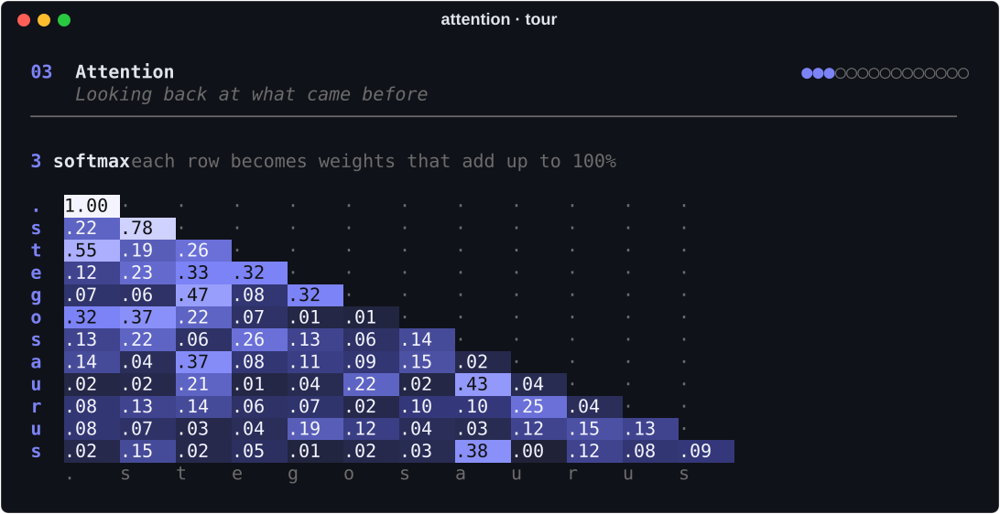
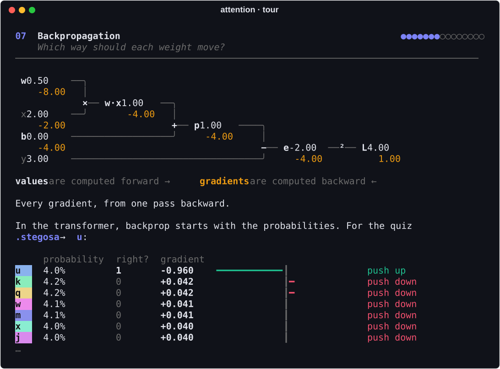
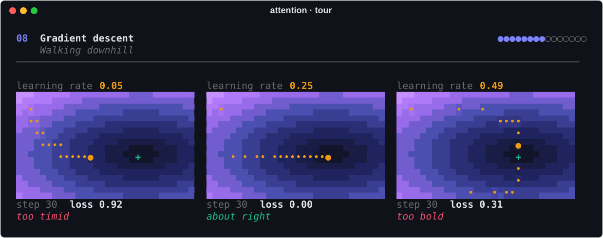
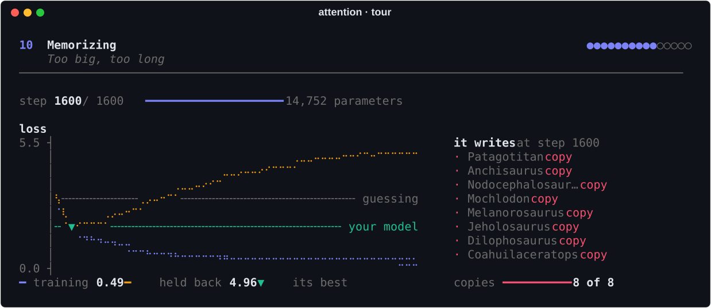
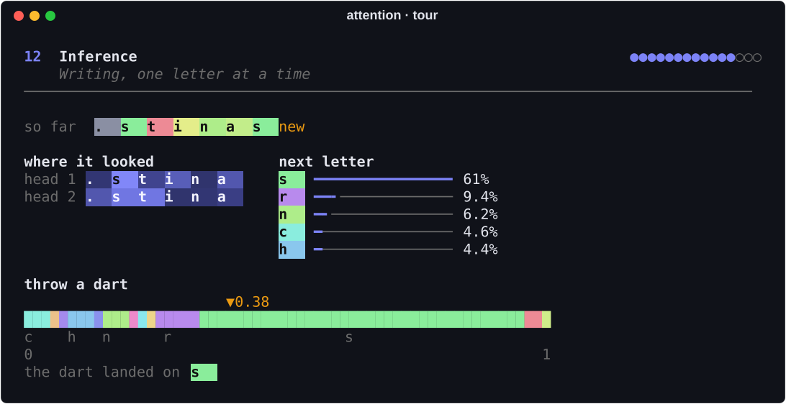
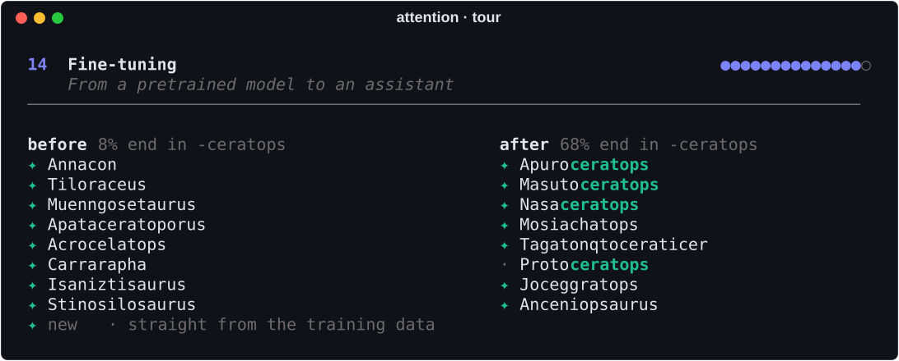
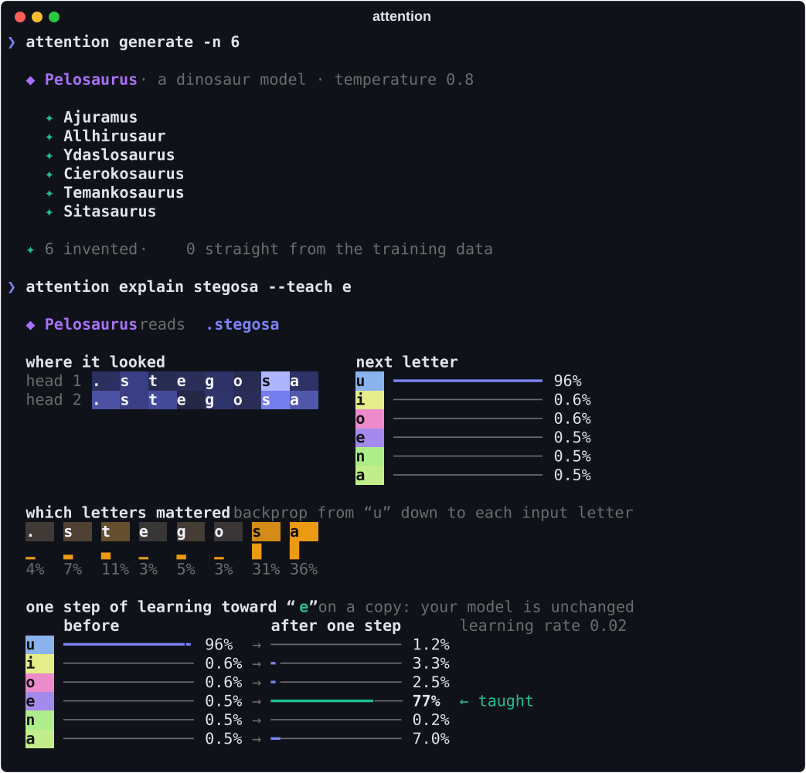

<h1 align="center">attention</h1>

<p align="center">
  <b>A guided tour of how LLMs work, in your terminal.</b><br>
  Build a tiny transformer, watch backpropagation train it, and keep the model you made.
</p>

<p align="center">
  <a href="https://github.com/adamtrain/attention/actions/workflows/ci.yml"></a>
  
  <a href="https://github.com/astral-sh/uv"></a>
  <a href="https://github.com/astral-sh/ruff"></a>
  <a href="LICENSE"></a>
</p>

<p align="center">
  
</p>

## Why attention

- **It's the real thing, just small.** A working transformer with embeddings, causal
  self-attention, an MLP, residual connections and normalization. It has a little over 4,000
  parameters to GPT-3's 175 billion, and it trains in about a second.
- **You see the actual numbers.** Every picture of the transformer in the tour comes from your
  model's own weights, activations and gradients, not from illustrations.
- **Backprop you can follow.** The chain rule on a single neuron, one node at a time; then the
  gradient leaving the transformer's output and flowing back through every layer; then
  gradient descent, down a landscape and on your model.
- **Watch it learn.** Loss curves, weights shifting, gradients per layer, and samples going
  from gibberish to convincing dinosaurs, live.
- **From pretraining to chatbot.** Watch an oversized model memorize instead of learn,
  fine-tune a copy of yours toward one kind of word, nudge it with your own thumbs-up, and see
  why a model can't tell its inventions from the real thing.
- **Different every time.** Every run starts from new random numbers, so your model, and
  the name it gives itself, is one of a kind.
- **Something to keep.** When the tour ends, your model is saved, and `attention generate`
  and `attention explain` keep working with it.
- **Runs anywhere.** Pure NumPy and Rich. No GPU, no PyTorch, no downloads, no API keys.

## Install

You'll need [uv](https://docs.astral.sh/uv/), which takes care of Python for you:

```sh
uv tool install git+https://github.com/adamtrain/attention
```

That puts `attention` on your `PATH`. Then just run:

```sh
attention
```

To try it without installing anything, run `uvx --from git+https://github.com/adamtrain/attention attention`.

The tour looks best in a terminal at least 100 columns wide and 40 rows tall, with true color.
It works at 80 columns. Every animation shows its first frame and waits, so you can read what
it's about to show before it moves.

| Key | |
| --- | --- |
| **space** | Move on, start an animation, or pause and resume one that's playing |
| **→** | Skip to the end of an animation |
| **r** | Play an animation again, from the start. Anything random comes out differently, and replaying pretraining trains a whole new model from a new seed |
| **q** | Quit |

## The tour

First you choose what your model will learn to invent: **dinosaurs**, **names** or **English
towns**, each a few hundred real examples. Then you go through fifteen short chapters:

| | | |
| --- | --- | --- |
| 1 | **Tokens** | Text becomes numbers, and every word a little set of next-letter quizzes. Then byte-pair encoding, live on your word list: how real models pick their chunks. |
| 2 | **Embeddings** | Each token looks up a vector of learned numbers, and positions get vectors too. |
| 3 | **Attention** | Multiplying by a grid of weights and the dot product, worked through on real numbers; queries, keys and values; the causal mask; softmax. Your model's real scores, animated. |
| 4 | **Softmax** | Scores become probabilities, and temperature makes guesses bolder or safer. |
| 5 | **The whole model** | The full diagram, the MLP's detectors firing, residual connections and norms, where the parameters live, and the entire forward pass in about 25 lines of your model's own source. |
| 6 | **Loss** | −log p, why being sure and wrong costs so much, and how surprised the untrained model is at every quiz. |
| 7 | **Backpropagation** | The chain rule on one neuron, then the gradient flowing back through the transformer. |
| 8 | **Gradient descent** | Three learning rates race down a landscape; then one real step on your model. |
| 9 | **Pretraining** | The live dashboard above: 400 steps, from gibberish to dinosaurs. |
| 10 | **Memorizing** | A model too big, trained too long: overfitting, and why yours stopped when it did. |
| 11 | **What it learned** | Before and after: every quiz, a map of the embeddings, and each attention head. |
| 12 | **Inference** | Writing one letter at a time with the dice roll shown; the KV cache and the context window; temperature and top-p; hallucination. |
| 13 | **Under the microscope** | Backprop after training: which letters swayed a prediction, and what one step of learning would change. |
| 14 | **Fine-tuning** | The pretraining loop with three changes: specialize a copy of your model on a handful of examples, see how little its weights move and what it forgets, and how chatbots are made. Then teach it with your own feedback. |
| 15 | **Your model** | What you can do with it now, how it compares with GPT-3, and the whole story in one table. |

**Attention, with real numbers.** Each position scores every earlier one, the causal mask
hides the future, and softmax turns each row into weights.

<p align="center">
  
</p>

**Backprop, step by step.** Values are computed forward and gradients backward, node by
node, each with the rule that produced it. Then the same idea at the transformer's output: the
gradient for each token's score is its probability, minus 1 for the right answer.

<p align="center">
  
</p>

**Gradient descent.** Three walkers set off down the same valley: one too timid, one about
right, one so bold that it zigzags.

<p align="center">
  
</p>

**Memorizing.** Give a model too much room and too many passes, and it learns the answers
instead of the patterns. Its loss on words it trained on keeps falling while its loss on
held-back words climbs past pure guessing, and nearly everything it writes is a copy.

<p align="center">
  
</p>

**Inference.** The model runs forward, lines its probabilities up from 0 to 1, and throws a
dart. You see where each head looked and what it expected at every letter.

<p align="center">
  
</p>

**Fine-tuning.** A copy of your model trains a little more on one family of words, like the
horned *-ceratops* dinosaurs, and its inventions follow. Then you pick the words you like and
watch the odds of writing them jump: learning from feedback, in miniature.

<p align="center">
  
</p>

### A note on backprop at inference

Backprop doesn't run when a model writes. Generating only runs the model forward, and its
weights stay frozen, for your model and for chatbots alike. The tour says so, then puts
backprop to two other uses after training. It works as a microscope: backpropagating from one
prediction down to the input letters shows which of them swayed it. And it shows what one step
of learning *would* do if you insisted on a different answer, on a throwaway copy of the
model. Fine-tuning and feedback, in the chapter after, are where backprop runs for real again.

## Your model

Your model is saved when training ends, and it names itself after one of its own inventions.
From then on:

```sh
attention generate                 # invent ten new dinosaurs (or names, or towns)
attention generate -t 1.5          # ...stranger ones, at a higher temperature
attention generate -p 0.5          # ...safer ones, only picking from the likeliest letters
attention generate stego           # ...ones that start with "stego"
attention explain stegosa          # one prediction up close, with backprop as a microscope
attention explain stegosa --teach e  # ...and what one step of learning toward "e" would do
attention info                     # everything about it, and how to make it again
attention train                    # train a new one, with the live dashboard
attention clean                    # delete it when you're done
```

<p align="center">
  
</p>

A ✦ marks a word that isn't in the training data: the model invented it. A · marks one it
reproduced from what it learned.

### Commands and options

| Command | |
| --- | --- |
| `attention`, `attention tour` | The guided tour |
| `attention train` | Train a new model with the live dashboard, and save it |
| `attention generate [START]` | Invent new words, optionally starting with some letters |
| `attention explain START` | Watch one prediction up close |
| `attention info` | Your model's vital statistics |
| `attention clean` | Delete everything attention has saved |

| Option | |
| --- | --- |
| `-c, --corpus NAME` | `dinosaurs`, `names`, `towns`, or a file with one word per line (`tour`, `train`) |
| `-s, --seed N` | Make a particular model again (`tour`, `train`) |
| `--chapter N` | Start the tour at chapter N; it trains a model first if it needs one |
| `--auto` | Let the tour play by itself |
| `--fast` | Speed up the animations (`tour`), or skip the pacing entirely (`train`) |
| `--steps N` | Training steps (`train`, default 400) |
| `-n, --count N` / `-t, --temperature T` | How many words, and how adventurous (`generate`) |
| `-p, --top-p P` | Only pick from the likeliest letters that add up to P (`generate`) |
| `--plain` | Just the words, one per line (`generate`; also the default when piped) |
| `--teach LETTER` | Show one step of learning toward a letter (`explain`) |
| `-m, --model PATH` | Use a model file other than your saved one |
| `-y, --yes` | Delete without asking first (`clean`) |

Your model lives in `~/.local/share/attention/model.npz` (or `$XDG_DATA_HOME/attention`, or
`%LOCALAPPDATA%\attention` on Windows; set `$ATTENTION_HOME` to put it anywhere). It's about
40 KB: a plain NumPy archive with the weights and a small JSON card, so `numpy.load` opens it
too.

That file is the only thing attention leaves on your computer. `attention clean` shows what it
will delete, asks, and removes it, along with its folder if nothing else is in there. It only
ever deletes attention's own model files, so anything else you keep in that folder stays put.

### Your own words

Train on any list with one word per line (letters a–z; at least 20 words, and a few hundred
is much better):

```sh
attention train --corpus my-words.txt
```

## How it works

The model is a one-block, GPT-style transformer, written out by hand in NumPy:

| | |
| --- | --- |
| **Tokens** | Single characters, plus `.` for the start and end of a word |
| **Architecture** | Token and position embeddings, then RMSNorm → 2-head causal self-attention → RMSNorm → MLP (16 → 64 → 16, ReLU), each with a residual connection, then RMSNorm → unembedding |
| **Size** | 16 numbers per token, and a little over 4,000 parameters (the exact count depends on the word list) |
| **Training** | 400 steps of Adam, 32 words a step, learning rate 0.01 with a short warmup and a decay. A tenth of the words are held back to measure real progress rather than memorization |
| **Baselines** | The dashboard's dashed lines are what you'd score with no neural network: counting how common each letter is, and counting which letter follows which |

There's no autograd library. Each layer has a forward function and a backward function, the
chain rule written out one layer at a time, and the tests check every gradient against finite
differences. The tour shows you this code: the attention block, the whole forward pass,
softmax, and the backward pass for a matrix multiply are all excerpts from the model you
train.

Along the way the tour trains a few throwaway models of its own, and none of them replace
yours: a bigger one to show overfitting, and fine-tuned copies of yours.

Every run gets a random seed, which decides the held-back words, the starting weights and the
order of the batches. The same seed and corpus always make the same model, so
`attention info` can tell you how to make yours again.

## Development

```sh
uv sync                         # set up the environment
uv run attention                # run from the checkout
uv run pytest                   # run the tests
uv run ruff check . && uv run ruff format .
uv run ty check                 # type-check
uv run scripts/screenshots.py   # regenerate docs/*.svg
```

The screenshots are drawn by the same code the tour and the commands use, from models trained
with fixed seeds.

```
src/attention/
├── model.py      # the transformer: every layer's forward and backward pass, by hand
├── train.py      # batches, Adam, the training loop, the no-network baselines
├── generate.py   # sampling, one dice roll at a time
├── explain.py    # backprop after training: which letters mattered, and one-step nudges
├── finetune.py   # fine-tuning on a niche, and learning from feedback
├── bpe.py        # byte-pair encoding, for the tour's look at real tokenizers
├── scalar.py     # a tiny autograd for single numbers (the tour's neuron)
├── corpus.py     # word lists, tokens and datasets
├── corpora/      # dinosaurs, names and English towns
├── store.py      # saving and loading your model
├── dashboard.py  # the live training view
├── views.py      # pictures shared by the tour and the commands
├── viz.py        # terminal drawing: heatmaps, bars, braille plots, a canvas
├── keys.py       # single keypresses
├── cli.py        # the commands
└── tour/         # one module per chapter, and the stage that paces them
```

## License

[CC0 1.0](LICENSE). attention is dedicated to the public domain.
