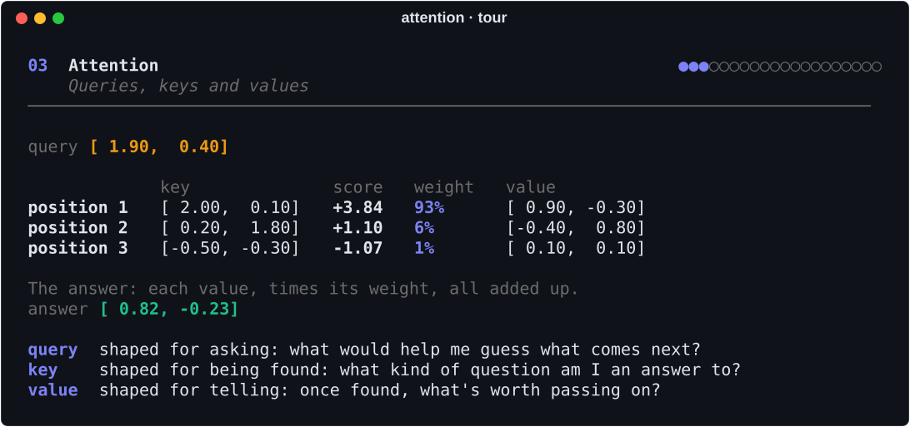
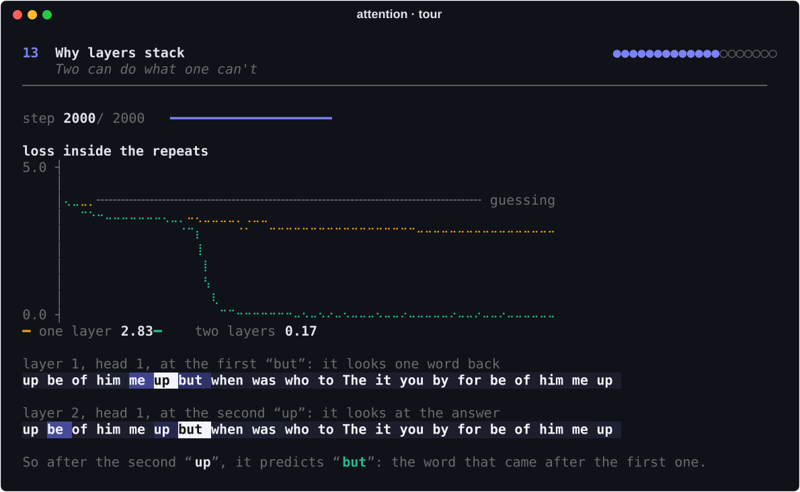
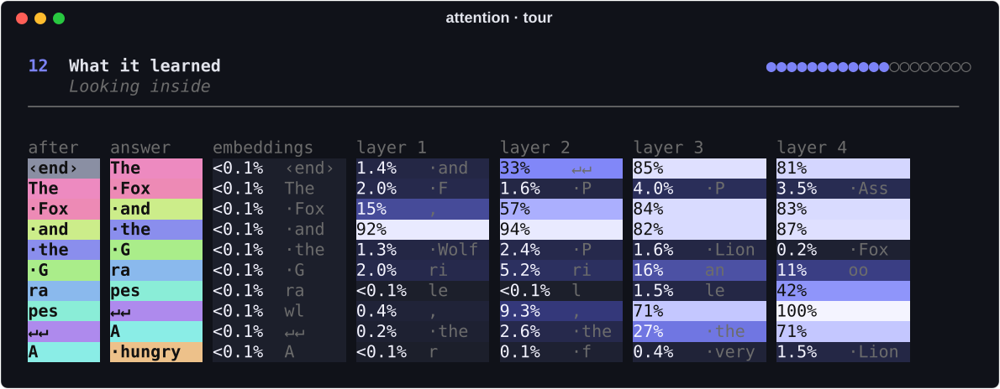
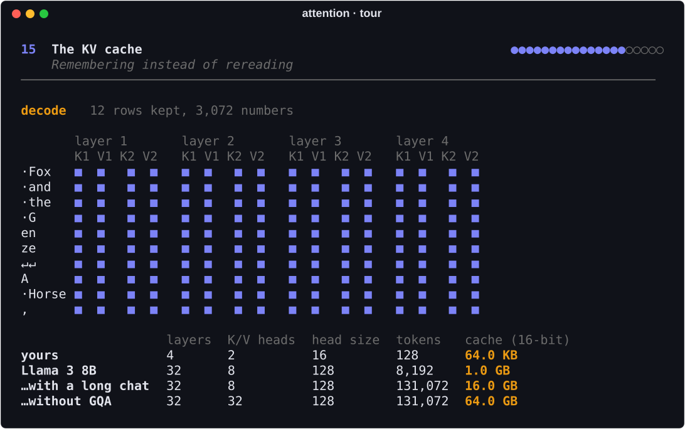
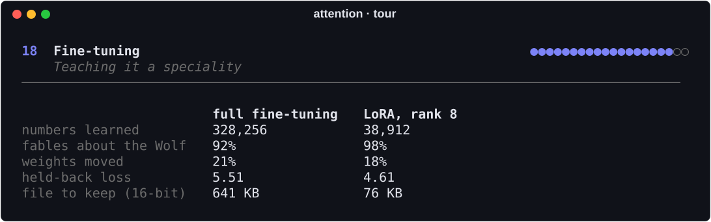
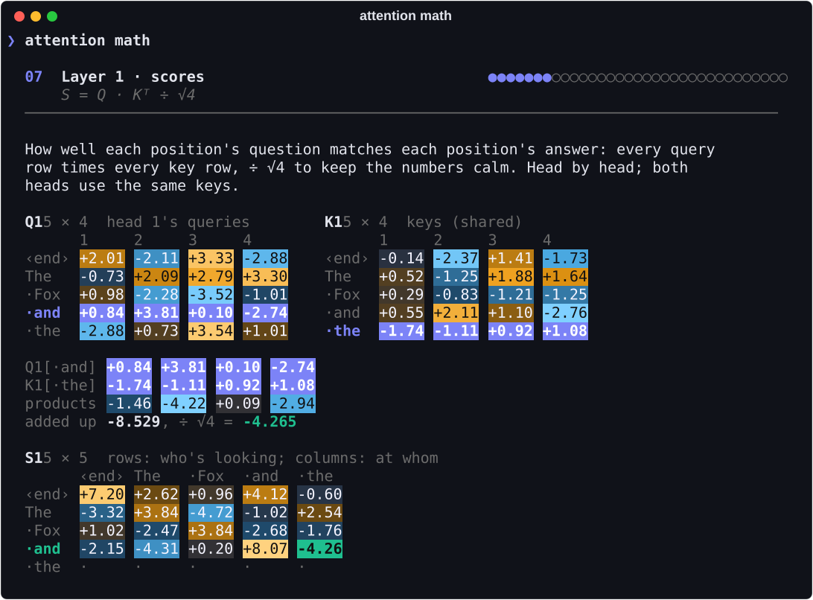

<h1 align="center">attention</h1>

<p align="center">
  <b>A guided tour of how LLMs work, in your terminal.</b><br>
  Build a small language model the way the big ones are built, watch it learn, look inside it, and keep it.
</p>

<p align="center">
  <a href="https://github.com/adamtrain/attention/actions/workflows/ci.yml"></a>
  
  <a href="https://github.com/astral-sh/uv"></a>
  <a href="https://github.com/astral-sh/ruff"></a>
  <a href="LICENSE"></a>
</p>

<p align="center">
  
</p>

## Why attention

- **It's the real design, just small.** Text split into tokens by byte-pair encoding, and a
  four-layer transformer built like Llama: rotary position embeddings, grouped-query
  attention, a gated (SwiGLU) MLP, RMSNorm and tied embeddings. It has about 640,000
  parameters to Llama 3 8B's 8 billion, and it trains in a few minutes on your computer.
- **Queries, keys and values, for real.** A soft dictionary lookup on made-up numbers, then
  your model's real grids; why a key is not a value; and an experiment in which a two-layer
  model grows an induction head that a one-layer model can't, showing exactly what each of
  the three vectors is for.
- **Layers you can see into.** The residual stream, the logit lens (what the model would guess
  if it stopped after each layer), and what each of its twenty-four heads learned to look at.
- **Inference the way it's really done.** A working KV cache, prefill and decode, why
  grouped-query attention exists, what API prompt caching keeps, and the dials you'll find in
  every chatbot's API: temperature, top-k and top-p.
- **From pretraining to chatbot.** Memorization you can watch (and pull back out of the
  model), quantization down to 8, 4 and 2 bits, fine-tuning with and without LoRA, and a chat
  model trained on a chat template, with the loss counting only its replies.
- **You see the actual numbers.** Every picture comes from your model's own weights,
  activations and gradients, not from illustrations.
- **Something to keep.** When the tour ends, your model and its chat version are saved, and
  `attention generate`, `attention chat` and `attention explain` keep working with them.
- **Runs anywhere.** Pure NumPy and Rich. No GPU, no PyTorch, no downloads, no API keys.

## Install

You'll need [uv](https://docs.astral.sh/uv/), which takes care of Python for you:

```sh
uv tool install git+https://github.com/adamtrain/attention
```

That puts `attention` on your `PATH`. Then just run:

```sh
attention
```

To try it without installing anything, run `uvx --from git+https://github.com/adamtrain/attention attention`.

The tour looks best in a terminal at least 100 columns wide and 40 rows tall, with true color.
It works at 80 columns. Every animation shows its first frame and waits, so you can read what
it's about to show before it moves.

| Key | |
| --- | --- |
| **space** | Move on, start an animation, or pause and resume one that's playing |
| **→** | Skip to the end of an animation |
| **r** | Play an animation again, from the start. Anything random comes out differently, and replaying pretraining trains a whole new model from a new seed |
| **q** | Quit |

## The tour

First you choose what your model will learn to write: **fables** (Aesop and others, from
Greece to India), **fairy tales** (Grimm, Andersen and Andrew Lang's Fairy Books) or
**Shakespeare** (all of his plays). Then you go through twenty chapters:

| | | |
| --- | --- | --- |
| 1 | **Tokens** | Byte-pair encoding, live on your text: the merges, the vocabulary it builds, special tokens like `<\|endoftext\|>`, and every position as a next-token quiz. |
| 2 | **Embeddings** | Each token looks up a row of 96 learned numbers, and the residual stream begins. |
| 3 | **Attention** | A fuzzy dictionary lookup: queries, keys and values, first with made-up numbers, then in your model. Why three vectors, the QK and OV circuits, the causal mask, heads, and grouped-query attention. |
| 4 | **Position** | Why attention alone can't tell order, and RoPE: turning queries and keys like clock hands, so a match depends on distance. |
| 5 | **Softmax** | Scores become probabilities, and temperature makes guesses bolder or safer. |
| 6 | **The stack** | The gated MLP at work, residual connections and norms, four layers stacked, where the parameters live, and your model's config.json next to Llama 3's. |
| 7 | **Loss** | −log p, why being sure and wrong costs so much, and perplexity. |
| 8 | **Backpropagation** | The chain rule on one neuron, then the gradient flowing back through all four layers. |
| 9 | **Gradient descent** | Three learning rates race down a landscape; one real step; AdamW, the learning-rate schedule and gradient clipping. |
| 10 | **Pretraining** | The live dashboard above: a few minutes of real training, with each layer's guess taking shape. |
| 11 | **Memorizing** | A model with too little to read, for too long: overfitting, and pulling a memorized fable back out of it word for word. |
| 12 | **What it learned** | Before and after, which tokens ended up neighbors, what each of the 24 heads looks at, and the logit lens. |
| 13 | **Why layers stack** | A one-layer and a two-layer model race to learn in-context copying; only the two-layer one can. Then its induction head, taken apart: the clearest reason a key is not a value. |
| 14 | **Inference** | Writing one token at a time, the dart that picks them, temperature, top-k, top-p, greedy decoding, and hallucination. |
| 15 | **The KV cache** | Why keys and values are kept and queries aren't, prefill and decode, the speed-up measured on your model, and what the cache costs at Llama's scale. |
| 16 | **Under the microscope** | Backprop after training: which tokens swayed a prediction, and what one step of learning would change. |
| 17 | **Quantization** | Your model rounded to 16, 8, 4, 3 and 2 bits per weight: what it saves, what it costs, and what a Q4_K_M file is. |
| 18 | **Fine-tuning** | A copy specializes on one kind of story, forgets a little, and then LoRA does the same with a small fraction of the numbers. |
| 19 | **Chat** | Chat templates, special tokens and loss masks: your model learns to answer. Then you teach it with your own feedback. |
| 20 | **Your model** | What you can do with it now, how it compares with GPT-3 and Llama 3, and the whole story in one table. |

**Queries, keys and values.** Attention is a fuzzy lookup: the query is compared with every
key, and the answer is a blend of the values, weighted by how well each key matched. Separate
grids let the model make asking, being found and telling three different things.

<p align="center">
  
</p>

**Why layers stack.** A one-layer and a two-layer model learn to copy from earlier in a
string of words. Only the second can: its first layer writes “the word before me” into each
position, and its second layer's keys read it. That's an induction head.

<p align="center">
  
</p>

**The logit lens.** Stop after each layer and read the residual stream as if it were the end
of the model: some answers are clear after one layer, others only come together at the last.

<p align="center">
  
</p>

**The KV cache.** Every layer's keys and values, kept for every position written so far, so
that each new token only needs its own. At Llama's scale, that's gigabytes per conversation.

<p align="center">
  
</p>

**Memorizing.** Given too little to read, for too long, a model learns its text by heart:
start one of its fables for it, and it recites the rest.

<p align="center">
  
</p>

**Fine-tuning and LoRA.** A copy of your model specializes in one kind of story. LoRA does it
by learning small corrections to a frozen model, and forgets less along the way.

<p align="center">
  
</p>

### A note on backprop at inference

Backprop doesn't run when a model writes. Generating only runs the model forward, and its
weights stay frozen, for your model and for chatbots alike. The tour says so, then puts
backprop to two other uses after training. It works as a microscope: backpropagating from one
prediction down to the tokens that went in shows which of them swayed it. And it shows what
one step of learning *would* do if you insisted on a different answer, on a throwaway copy of
the model. Fine-tuning, LoRA, chat and feedback are where backprop runs for real again.

## Every number, by hand

`attention math` is the whole forward pass in longhand, on a model small enough to print: the
same architecture as yours, shrunk to 8 numbers per token, 2 layers, 2 query heads sharing 1
key/value head, an MLP 12 wide, and a vocabulary of 12 whole words. It trains for about a
second on fable titles like *The Fox and the Crow*, then reads one while you watch every
operation happen to real numbers: the embedding lookup, RMSNorm, every product and sum of
every matrix multiply, RoPE turning each pair, the scores, the mask and softmax, the blend of
values, the residual adds, SwiGLU's switch, and the scores for every word. What's being read
is lit up in purple and what's being written in green, and at the end its longhand answer
matches the model's own forward pass exactly.

```sh
attention math                      # reads “The Fox and the”
attention math "The Wolf and the"   # or any of its words: the, and, Fox, Wolf, Lion, Eagle, Ass, Crow, Cat, Dog
```

<p align="center">
  
</p>

## Your model

Your model is saved when training ends, and it names itself after a name it made up. From
then on:

```sh
attention generate                         # write three new fables (or tales, or scenes)
attention generate "The Fox and the"       # ...carrying on from a start you give it
attention generate -t 1.2 -k 20 -p 0.9     # ...with the dials: temperature, top-k, top-p
attention chat                             # talk to its chat version
attention explain "The Fox and the"        # one prediction up close: heads, layers, backprop
attention explain "The Fox and the" --teach Crow  # ...and one step of learning toward " Crow"
attention tokenize "Any text at all"       # see how its tokenizer splits text
attention info                             # everything about it, with its config.json
attention train                            # train a new one, with the live dashboard
attention clean                            # delete it all when you're done
```

<p align="center">
  
</p>

In what it writes, anything shaded red is a run of twelve tokens or more copied word for word
from its training text; the rest it made up.

### Commands and options

| Command | |
| --- | --- |
| `attention`, `attention tour` | The guided tour |
| `attention train` | Train a new model with the live dashboard, and save it |
| `attention generate [TEXT]` | Write new documents, or carry on from some text |
| `attention chat` | Talk to the chat version of your model (made the first time, if the tour didn't) |
| `attention explain TEXT` | Watch one prediction up close |
| `attention tokenize TEXT` | See how your model's tokenizer splits some text |
| `attention math [TEXT]` | Watch every operation of the forward pass, on a model small enough to print |
| `attention info` | Your model's vital statistics, config.json and weights |
| `attention clean` | Delete everything attention has saved |

| Option | |
| --- | --- |
| `-c, --corpus NAME` | `fables`, `fairytales`, `shakespeare`, or a text file (`tour`, `train`) |
| `-s, --seed N` | Make a particular model again (`tour`, `train`); train the little one differently (`math`) |
| `--chapter N` | Start the tour at chapter N; it trains a model first if it needs one, or picks up your saved one if it's the same corpus and seed |
| `--auto` | Let the tour, or `math`, play by itself |
| `--fast` | Speed up the animations (`tour`, `math`), or skip the drawing entirely (`train`) |
| `--steps N` | Training steps (`train`; the default is enough to read the text about 16 times) |
| `-n, --count N` / `--tokens N` | How many to write, and how long each can be (`generate`) |
| `-t, --temperature T` | How adventurous (`generate`, `chat`) |
| `-k, --top-k K` / `-p, --top-p P` | Only pick from the k likeliest tokens, or the likeliest ones adding up to P (`generate`) |
| `--plain` | Just the text (`generate`; also the default when piped) |
| `--teach WORD` | Show one step of learning toward a word (`explain`) |
| `-m, --model PATH` | Use a model file other than your saved one |
| `-y, --yes` | Delete without asking first (`clean`) |

Your model lives in `~/.local/share/attention/model.npz` (or `$XDG_DATA_HOME/attention`, or
`%LOCALAPPDATA%\attention` on Windows; set `$ATTENTION_HOME` to put it anywhere), with its
chat version beside it in `model.chat.npz`. Each is 5 to 8 MB: a plain NumPy archive with the
weights, the tokenizer's merges, the text it learned from, and a small JSON card, so
`numpy.load` opens it too.

Those files are the only things attention leaves on your computer. `attention clean` shows
what it will delete, asks, and removes them, along with their folder if nothing else is in
there. It only ever deletes attention's own files, so anything else you keep in that folder
stays put.

### Your own text

Train on any text file (at least 20,000 characters, and a few hundred thousand is much
better). Separate documents with a line holding only `<|endoftext|>`, or with two blank
lines; one long text is cut into pages:

```sh
attention train --corpus my-book.txt
```

## How it works

The model is a small Llama-style transformer, written out by hand in NumPy:

| | |
| --- | --- |
| **Tokens** | Byte-pair encoding learned from the training text: 2,048 tokens, of which 3 are special (`<\|endoftext\|>`, `<\|user\|>`, `<\|assistant\|>`), 96 are single characters, and 1,949 are merges. Text is cut into chunks first with GPT-2's rule, keeping runs of newlines together as GPT-4's does |
| **Architecture** | Token embeddings, then 4 layers of: RMSNorm → causal self-attention (6 query heads sharing 3 key/value heads, with rotary position embeddings on the queries and keys) → RMSNorm → SwiGLU MLP (96 → 288 → 96), each with a residual connection. Then RMSNorm, and the embedding table again for the output |
| **Size** | 96 numbers per token, 639,840 parameters (196,608 of them in the embedding table), and a context window of 128 tokens |
| **Training** | AdamW (β 0.9 and 0.95, weight decay 0.1), 16 stretches of 128 tokens a step, learning rate 0.01 after a 100-step warmup, easing down along a cosine to 0.001, with the gradient clipped at 1.0. Enough steps to read the text about 16 times, but no more than 3,600, about 9 minutes on a laptop: about 2,800 for the fables, which it does read about 16 times, and 3,600 for Shakespeare and the fairy tales, which it reads about 5 times and 3 times. The biggest models read most of their text only once. A tenth of the documents are held back, to measure real progress rather than memorization |
| **Baselines** | The dashboard's dashed lines are what you'd score with no neural network: counting how common each token is, and counting which token follows which |

There's no autograd library. Each layer has a forward function and a backward function, the
chain rule written out one layer at a time (LoRA's too), and the tests check every gradient
against finite differences, and check that writing with the KV cache gives exactly the same
answers as rereading everything. The tour shows you this code: the attention block, RoPE, the
whole forward pass, softmax, the KV cache and the backward pass for a matrix multiply are all
excerpts from the model you train.

Along the way the tour trains several throwaway models of its own, and none of them replace
yours: one that memorizes, the one-layer and two-layer models that race, fine-tuned copies of
yours, and its chat version, which is saved beside it.

Every run gets a random seed, which decides the held-back documents, the tokenizer, the
starting weights and the order of the batches. The same seed and corpus always make the same
model, so `attention info` can tell you how to make yours again.

### The texts

The three built-in corpora are public-domain books from [Project
Gutenberg](https://www.gutenberg.org), with the licensing boilerplate, front matter, stage
directions and footnotes taken out, and turned into plain ASCII:

- **Fables**: four books of Aesop: *Three Hundred Aesop's Fables*, translated by George Fyler
  Townsend (1867); *The Fables of Aesop*, retold by Joseph Jacobs (1894); *Aesop's Fables*,
  translated by V. S. Vernon Jones (1912); and *The Aesop for Children* (1919). Then *The
  Talking Beasts*, fables from Aesop to Bidpai and Krylov, edited by Kate Douglas Wiggin and
  Nora Archibald Smith (1911); Jataka tales from India in W. H. D. Rouse's *The Giant Crab*
  (1897) and Ellen C. Babbitt's *Jataka Tales* (1912) and *More Jataka Tales* (1922); and
  Ambrose Bierce's *Fantastic Fables* (1899). 1,399 fables, 1.4 MB.
- **Fairy tales**: *Household Tales by Brothers Grimm*, translated by Margaret Hunt (1884);
  *Fairy Tales of Hans Christian Andersen*; and all twelve of Andrew Lang's colored Fairy
  Books, from *The Blue Fairy Book* (1889) to *The Lilac Fairy Book* (1910). A tale retold
  under the same title in more than one book is kept, like a fable in several translations,
  and all its versions are held back together. 841 tales, 10.1 MB.
- **Shakespeare**: all 38 plays, from *The Complete Works of William Shakespeare*. 744 scenes,
  4.8 MB.

`uv run scripts/corpora.py` downloads the books and rebuilds them.

## Development

```sh
uv sync                         # set up the environment
uv run attention                # run from the checkout
uv run pytest                   # run the tests
uv run ruff check . && uv run ruff format .
uv run ty check                 # type-check
uv run scripts/screenshots.py   # regenerate docs/*.svg (trains real models: a few minutes)
uv run scripts/corpora.py       # rebuild the corpora from the books
```

The screenshots are drawn by the same code the tour and the commands use, from models trained
with fixed seeds.

```
src/attention/
├── tokenizer.py  # byte-pair encoding: learning merges, encoding and decoding
├── corpus.py     # the texts, their documents, and stretches of tokens
├── model.py      # the transformer: every layer's forward and backward pass, the KV cache, the logit lens
├── train.py      # AdamW, the schedule, clipping, the training loop, the baselines
├── generate.py   # writing with the KV cache, the dials, and spotting copied text
├── induction.py  # the one-layer-against-two experiment, and finding the circuit
├── quantize.py   # rounding weights to fewer bits
├── finetune.py   # fine-tuning, LoRA, chat templates and loss masks, feedback
├── explain.py    # backprop after training: which tokens mattered, and one-step nudges
├── longhand.py   # attention math: the forward pass one operation at a time, on a tiny model
├── scalar.py     # a tiny autograd for single numbers (the tour's neuron)
├── store.py      # saving and loading models
├── dashboard.py  # the live training view
├── views.py      # pictures shared by the tour and the commands
├── viz.py        # terminal drawing: heatmaps, bars, braille plots, a canvas
├── keys.py       # single keypresses
├── cli.py        # the commands
├── corpora/      # fables, fairy tales and Shakespeare
└── tour/         # one module per chapter, and the stage that paces them
```

## License

[CC0 1.0](LICENSE). attention is dedicated to the public domain, and so are the texts it
learns from.
